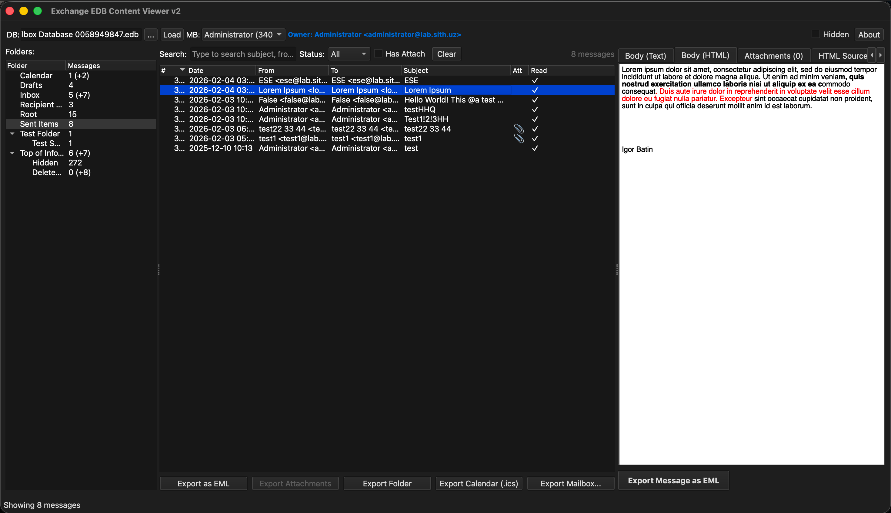
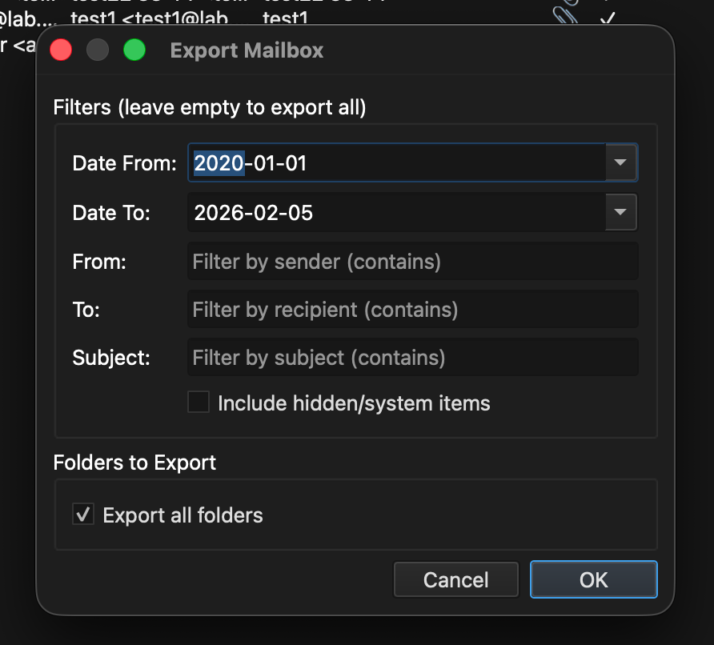

#  Exchange EDB Viewer & Exporter

A Python GUI application for viewing and exporting emails from Microsoft Exchange EDB (Extensible Storage Engine Database) files.

## Features

- **Dark mode UI** consistent across Windows and macOS
- **Database statistics** displayed after loading (size, mailboxes, messages, tables)
- **Browse mailbox folder structure** with proper folder names
- **View messages** with From, To, Cc, Bcc, Subject, Date fields
- **Display email body** (text and HTML views with white background for readability)
- **Extract and save attachments** (including large Long Value attachments)
- **Export emails as EML format** (with body, headers, and attachments)
- **Export entire folders** to EML files
- **Export entire mailbox** with date/subject/sender filters
- **Export calendar items** to iCalendar (.ics) format
- **Search and filter** messages by subject, from, to, read status, attachments
- **Mailbox owner detection** from Mailbox table (properly decompressed)
- **Multi-encoding support** (UTF-8, Cyrillic Windows-1251, KOI8-R, etc.)
- **Hidden/system items toggle** in filter bar

## Screenshots

### Main Interface


### Mailbox Picker


### Export Mailbox Dialog


## Requirements

- Python 3.10+
- PyQt6
- libesedb-python (pyesedb)
- dissect.esedb (for LZXPRESS decompression)

## Installation

### Windows

1. Install **Python 3.12** from [python.org](https://www.python.org/ftp/python/3.12.0/python-3.12.0-amd64.exe)
   - **Important:** Check "Add Python to PATH" during installation
   - **Note:** Python 3.13+ is NOT supported (no pre-built wheels available)

2. Clone and run install script:
```cmd
git clone https://github.com/igrbtn/MDB_Explorer.git
cd MDB_Explorer
install_windows.bat
```

> **Note:** If installation fails, you may need [Visual C++ Build Tools](https://visualstudio.microsoft.com/visual-cpp-build-tools/) (select "Desktop development with C++").

### macOS

1. Run install script (installs Homebrew and Python if needed):
```bash
git clone https://github.com/igrbtn/MDB_Explorer.git
cd MDB_Explorer
chmod +x install_mac.sh
./install_mac.sh
```

### Ubuntu/Debian

1. Run install script:
```bash
git clone https://github.com/igrbtn/MDB_Explorer.git
cd MDB_Explorer
chmod +x install_ubuntu.sh
./install_ubuntu.sh
```

### Manual Installation

```bash
pip install PyQt6 libesedb-python dissect.esedb python-dateutil chardet
```

## Usage

### GUI Mode

```bash
python gui_viewer_v2.py [path_to_edb_file]
```

**Windows (if multiple Python versions installed):**
```cmd
py -3.12 gui_viewer_v2.py [path_to_edb_file]
```

Or launch without arguments and use the Browse button (or click the DB field) to select an EDB file.

### Command Line Mode

```bash
python cli.py <edb_file> <command> [options]
```

**Windows:** `py -3.12 cli.py <edb_file> <command> [options]`

**Commands:**

| Command | Description |
|---------|-------------|
| `info` | Show database information |
| `list-mailboxes` | List all mailboxes |
| `list-folders` | List folders in a mailbox |
| `list-emails` | List/search emails |
| `export-email` | Export single email to EML |
| `export-folder` | Export folder to EML files |
| `export-mailbox` | Export entire mailbox |
| `export-calendar` | Export calendar to ICS |

**Examples:**

```bash
# Show database info
python cli.py database.edb info

# List all mailboxes
python cli.py database.edb list-mailboxes

# Save mailboxes to CSV
python cli.py database.edb list-mailboxes --csv mailboxes.csv

# List folders in mailbox 103
python cli.py database.edb list-folders -m 103

# Search emails containing "invoice"
python cli.py database.edb list-emails -m 103 -s "invoice"

# List emails with date filter and save to CSV
python cli.py database.edb list-emails -m 103 --date-from 2024-01-01 --date-to 2024-12-31 --csv emails.csv

# Export single email
python cli.py database.edb export-email -m 103 -r 318 -o email.eml

# Export entire mailbox with folder structure
python cli.py database.edb export-mailbox -m 103 -o ./exported

# Export calendar to ICS
python cli.py database.edb export-calendar -m 103 -o calendar.ics
```

**Options:**

- `-m, --mailbox` - Mailbox number
- `-f, --folder` - Folder ID
- `-s, --search` - Search in subject/from/to
- `-n, --limit` - Limit number of results
- `--date-from` - Filter from date (YYYY-MM-DD)
- `--date-to` - Filter to date (YYYY-MM-DD)
- `--csv` - Save output to CSV file
- `-o, --output` - Output file/directory
- `-v, --verbose` - Verbose output

---

# Application Architecture

```
┌─────────────────────────────────────────────────────────────────────┐
│                         GUI Layer (PyQt6)                           │
├─────────────────────────────────────────────────────────────────────┤
│  Row 1: [DB: filename] [...] [Load] [stats label]      [About]     │
│  Row 2: [MB: -- Select Mailbox --]  [Owner]                        │
├─────────────┬───────────────────────┬───────────────────────────────┤
│  Left Panel │    Middle Panel       │      Right Panel              │
│             │                       │                               │
│ [Exp Folder]│ Search: [___] Status  │ [Exp EML] [Cal] [Attach]     │
│ [Exp Mbox]  │ [All] Has Attach      │                               │
│             │ Hidden Clear          │ From:    (value)              │
│ Folder Tree │                       │ To:      (value)              │
│ - Inbox     │ # Date From To Subj   │ Subject: (value)              │
│ - Sent      │ 1 2026 Admin...       │ Date:    (value)              │
│ - Drafts    │ 2 2026 User...        │                               │
│ - Deleted   │                       │ [Body Text][HTML][Attach]...  │
│ - ...       │                       │                               │
├─────────────┴───────────────────────┴───────────────────────────────┤
│                          Status Bar                                 │
└─────────────────────────────────────────────────────────────────────┘
```

## Project Structure

```
edb_exporter/
├── gui_viewer_v2.py      # Main GUI application (dark mode)
├── email_message.py      # Email extraction and EML export
├── calendar_message.py   # Calendar extraction and ICS export
├── lzxpress.py           # LZXPRESS decompression utilities
├── folder_mapping.py     # Folder name mapping
├── cli.py                # Command-line interface
├── icon.png              # Application icon
├── icon.ico              # Application icon (Windows)
├── VERSION               # Version number
├── src/
│   └── core/
│       └── ese_reader.py # ESE database utilities
├── requirements.txt      # Python dependencies
├── install_windows.bat   # Windows install script
├── install_mac.sh        # macOS install script
└── install_ubuntu.sh     # Ubuntu/Debian install script
```

## Data Flow

```
EDB File → pyesedb → Tables Dict → Folder/Message Indexing → GUI Display
                                          ↓
                    ┌─────────────────────┴─────────────────────┐
                    ↓                                           ↓
          Attachment extraction                          Body extraction
          (Long Value B+ tree)                     (LZXPRESS decompression)
                    ↓                                           ↓
              EML Export                              HTML/Text Display
                    ↓
            Calendar ICS Export
```

---

# Microsoft Exchange EDB Database Structure

## Overview

Exchange Server stores mailbox data in EDB files using Microsoft's **Extensible Storage Engine (ESE)**, also known as JET Blue. The database contains multiple tables organized by mailbox number.

## Database Layout

```
Exchange EDB File
│
├── System Tables
│   ├── MSysObjects        (Table catalog)
│   ├── MSysObjids         (Object IDs)
│   ├── MSysLocales        (Locale info)
│   └── MSysDatabaseMaintenance
│
├── Global Tables
│   ├── GlobalLocaleIds
│   ├── Mailbox            (Mailbox metadata - owner names)
│   ├── MailboxIdentity
│   └── Events             (Transaction log)
│
└── Per-Mailbox Tables (XXX = mailbox number, e.g., 101, 103)
    ├── Folder_XXX         (Folder definitions)
    ├── Message_XXX        (Email messages)
    ├── Attachment_XXX     (File attachments)
    ├── Recipient_XXX      (Recipients)
    └── ...other tables
```

## Key Tables

### Mailbox Table

Stores mailbox metadata including owner display name.

| Column | Type | Description |
|--------|------|-------------|
| `MailboxNumber` | Long | Unique mailbox identifier (100, 101, 102...) |
| `MailboxGuid` | Binary(16) | Mailbox GUID |
| `MailboxOwnerDisplayName` | LongText | Owner name (compressed) |
| `DisplayName` | LongText | Display name (compressed) |
| `MessageCount` | LongLong | Total message count |
| `LastLogonTime` | DateTime | Last logon timestamp |

**Decompression:** Owner names are compressed using ESE 7-bit encoding. Use `dissect.esedb.compression.decompress()` then decode as UTF-16-LE.

```python
from dissect.esedb.compression import decompress
decompressed = decompress(raw_value)
owner_name = decompressed.decode('utf-16-le').rstrip('\x00')
```

### Folder_XXX Table

Stores folder hierarchy and metadata.

| Column | Type | Description |
|--------|------|-------------|
| `FolderId` | Binary(26) | Unique folder identifier |
| `ParentFolderId` | Binary(26) | Parent folder reference |
| `DisplayName` | LongText | Folder name (UTF-16LE, often compressed) |
| `SpecialFolderNumber` | Long | Standard folder type (see below) |
| `MessageCount` | Long | Number of messages |

**Special Folder Numbers:**
```
1  = Root
9  = IPM Subtree (Top of Information Store)
10 = Inbox
11 = Outbox
12 = Sent Items
13 = Deleted Items
14 = Contacts
15 = Calendar
16 = Drafts
17 = Journal
18 = Notes
19 = Tasks
20 = Recoverable Items
21 = Recoverable Items - Deletions
22 = Recoverable Items - Versions
```

### Message_XXX Table

Stores email messages and calendar items.

| Column | Type | Description |
|--------|------|-------------|
| `MessageDocumentId` | Long | Unique message ID |
| `FolderId` | Binary(26) | Parent folder |
| `MessageClass` | LongText | Item type (compressed) |
| `DateReceived` | DateTime | FILETIME format |
| `DateSent` | DateTime | FILETIME format |
| `IsRead` | Bit | Read status |
| `IsHidden` | Bit | Hidden/system item flag |
| `HasAttachments` | Bit | Attachment indicator |
| `Importance` | Long | 0=Low, 1=Normal, 2=High |
| `DisplayTo` | LongText | Recipients display |
| `PropertyBlob` | LongBinary | MAPI properties (subject, sender, etc.) |
| `NativeBody` | LongBinary | HTML body (LZXPRESS compressed) |
| `SubobjectsBlob` | LongBinary | Attachment references |

**Message Classes (decompressed):**
```
IPM.Note                           - Standard email
IPM.Appointment                    - Calendar event
IPM.Schedule.Meeting.Request       - Meeting request
IPM.Schedule.Meeting.Resp.Pos      - Meeting accepted
IPM.Schedule.Meeting.Resp.Neg      - Meeting declined
IPM.Schedule.Meeting.Resp.Tent     - Meeting tentative
IPM.Schedule.Meeting.Canceled      - Meeting canceled
IPM.Task                           - Task item
IPM.Contact                        - Contact
IPM.Activity                       - Journal entry
```

### Attachment_XXX Table

Stores file attachments.

| Column | Type | Description |
|--------|------|-------------|
| `Inid` | LongLong | Unique attachment ID |
| `AttachmentId` | Binary | Full attachment identifier |
| `Content` | LongBinary | Attachment data or LV reference |
| `Size` | LongLong | Attachment size in bytes |
| `Name` | LongText | Filename (often compressed) |
| `ContentType` | LongText | MIME type |
| `PropertyBlob` | LongBinary | Attachment properties |

---

# Data Compression & Encoding

## ESE Column Compression Types

ESE uses different compression types indicated by the first byte:

| Type Byte | Description |
|-----------|-------------|
| `0x10` | 7-bit ASCII compression |
| `0x12` | 7-bit UTF-16 compression |
| `0x15` | 7-bit variant |
| `0x17` | Uncompressed or minimal compression |
| `0x18` | LZXPRESS compressed (columns > 1KB) |
| `0x19` | LZXPRESS variant |

**Decompression with dissect.esedb:**
```python
from dissect.esedb.compression import decompress

# Works for all compression types
decompressed = decompress(raw_column_data)
```

## NativeBody (HTML Body) Format

The NativeBody column contains HTML email content compressed with MS-XCA LZXPRESS.

**Header Structure (7 bytes):**
```
Byte 0:    Type marker (0x18 = LZXPRESS)
Bytes 1-2: Uncompressed size (little-endian 16-bit)
Bytes 3+:  Compressed payload
```

**Decompression:**
```python
from dissect.esedb.compression import decompress

html_bytes = decompress(native_body_data)  # Pass full data with header
html_text = html_bytes.decode('utf-8')
```

## PropertyBlob Structure

PropertyBlob contains MAPI properties including subject, sender, and message-id.

```
PropertyBlob Layout:
┌──────────────────────────────────────────────────────────────┐
│  Header bytes (property tags, types)                         │
├──────────────────────────────────────────────────────────────┤
│  ... metadata (GUIDs, addresses, timestamps) ...             │
├──────────────────────────────────────────────────────────────┤
│  Sender name ending with 'M' marker                          │
│  Example: "Administrator" + 0x4D ('M')                       │
├──────────────────────────────────────────────────────────────┤
│  Subject: length byte + subject text                         │
│  Example: 0x04 + "test" (4 bytes)                            │
├──────────────────────────────────────────────────────────────┤
│  Message-ID: <hex@domain>                                    │
│  Example: <8f372b33baa04242a7fe@lab.sith.uz>                 │
└──────────────────────────────────────────────────────────────┘
```

## Long Value (LV) Storage

Large binary data (>255 bytes) is stored in ESE's Long Value B+ tree:

```
Normal column value:
┌─────────────────────┐
│  Inline data        │
│  (up to 255 bytes)  │
└─────────────────────┘

Long Value reference:
┌─────────────────────┐      ┌─────────────────────┐
│  4-byte LV ID       │ ───> │  Actual data in     │
│  (reference)        │      │  LV B+ tree         │
└─────────────────────┘      └─────────────────────┘

Access via pyesedb:
  record.is_long_value(column_idx)  → True/False
  lv = record.get_value_data_as_long_value(column_idx)
  data = lv.get_data()  → bytes
```

---

# Key Modules

## `email_message.py`

**Classes:**
- `EmailMessage` - dataclass for email data (subject, from, to, body, attachments)
- `EmailExtractor` - extracts emails from EDB records
- `EmailAttachment` - attachment data structure

**Key Methods:**
- `extract_message(record, col_map, rec_idx)` - Extract complete email
- `_extract_sender(blob)` - Extract sender from PropertyBlob
- `_extract_subject(blob)` - Extract subject from PropertyBlob
- `to_eml()` - Export to EML format

## `calendar_message.py`

**Classes:**
- `CalendarEvent` - dataclass for calendar events
- `CalendarExtractor` - extracts calendar items from EDB
- `CalendarAttendee` - attendee data

**Key Methods:**
- `is_calendar_item(message_class)` - Check if item is calendar type
- `extract_event(record, col_map)` - Extract calendar event
- `to_ics()` - Export to iCalendar format
- `export_calendar_to_ics(events, path)` - Export multiple events

## `lzxpress.py`

**Functions:**
- `decompress_exchange_body(data)` - Decompress NativeBody HTML
- `extract_text_from_html(html_bytes)` - Extract plain text from HTML
- `get_body_preview(native_data, max_len)` - Get text preview
- `get_html_content(native_data)` - Get full HTML content

**Decompression Priority:**
1. Use `dissect.esedb.compression.decompress()` (most accurate)
2. Fallback to built-in decoder if dissect unavailable

---

# DateTime Handling

Exchange stores dates as Windows FILETIME (100-nanosecond intervals since 1601-01-01).

```python
import struct
from datetime import datetime, timezone

def filetime_to_datetime(filetime_bytes):
    if len(filetime_bytes) != 8:
        return None

    filetime = struct.unpack('<Q', filetime_bytes)[0]
    if filetime == 0:
        return None

    # FILETIME epoch difference (1601 to 1970)
    EPOCH_DIFF = 116444736000000000
    timestamp = (filetime - EPOCH_DIFF) / 10000000

    return datetime.fromtimestamp(timestamp, tz=timezone.utc)
```

---

# License

MIT License


[](https://www.buymeacoffee.com/igrbtnv)
